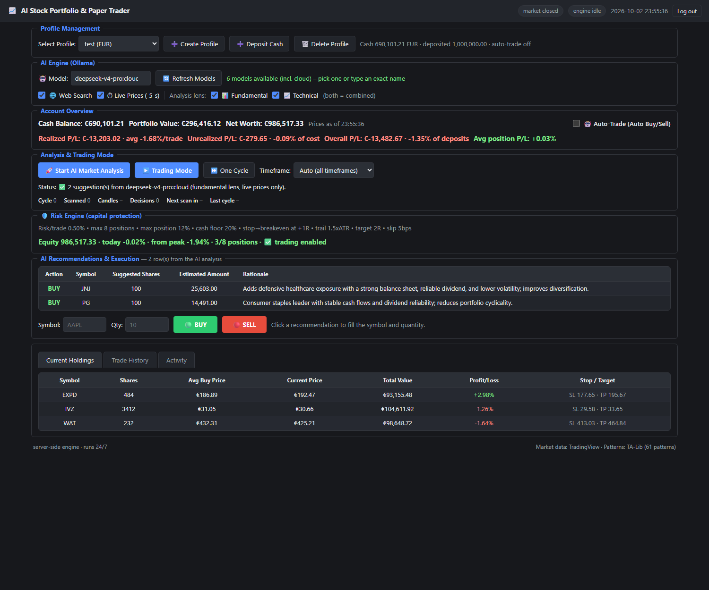
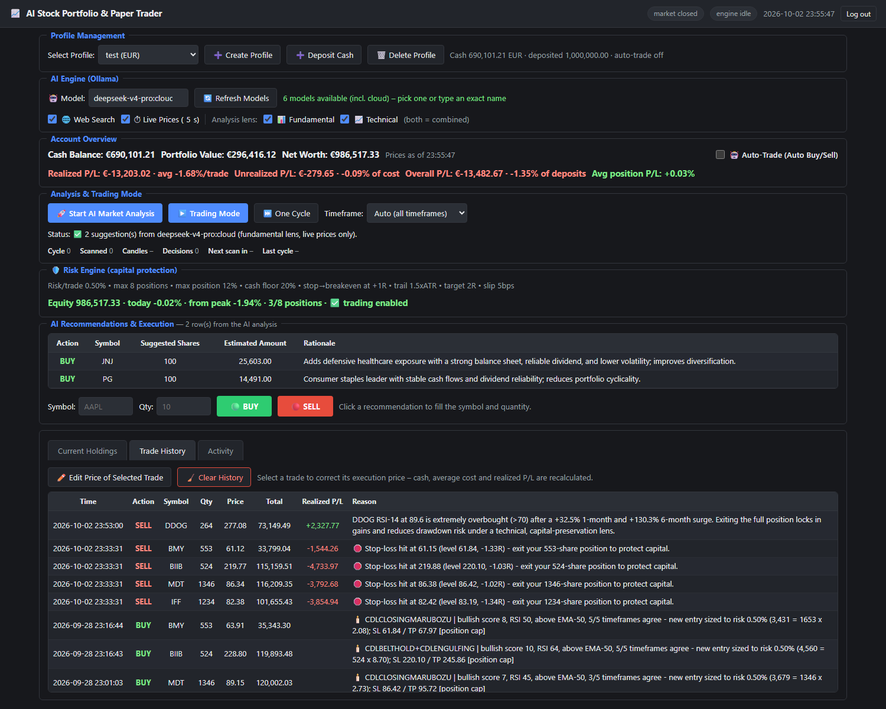
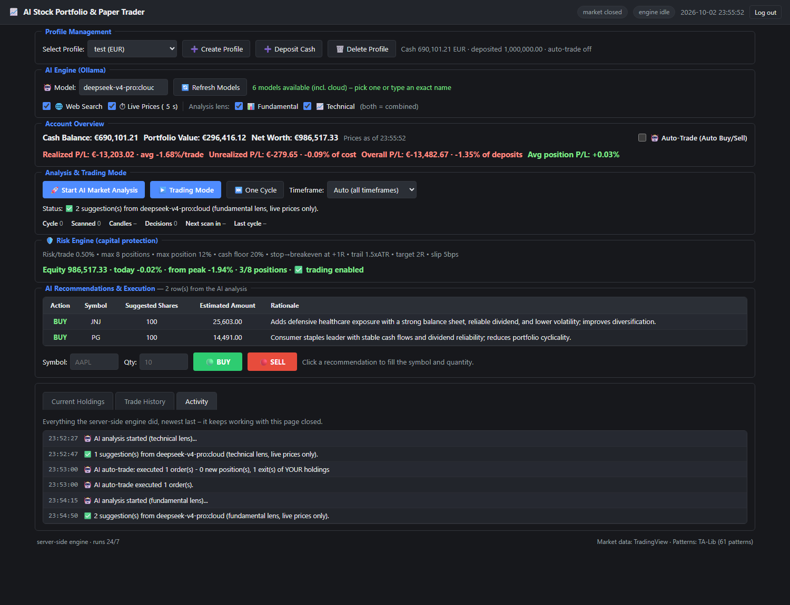
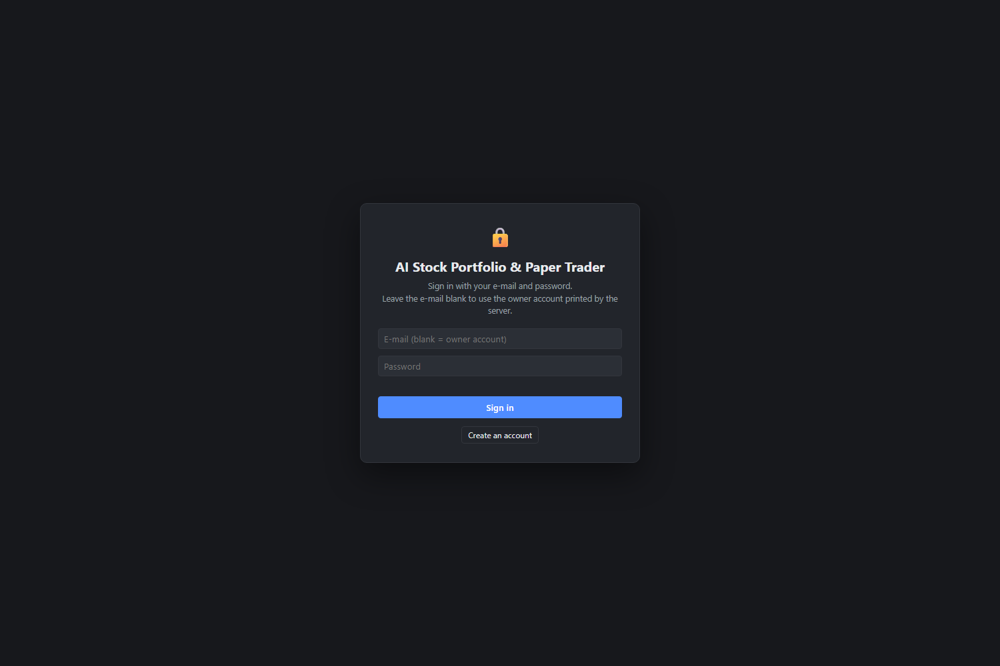
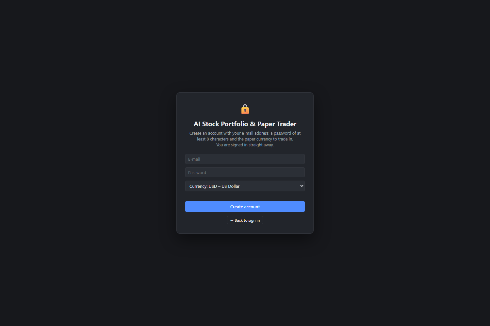
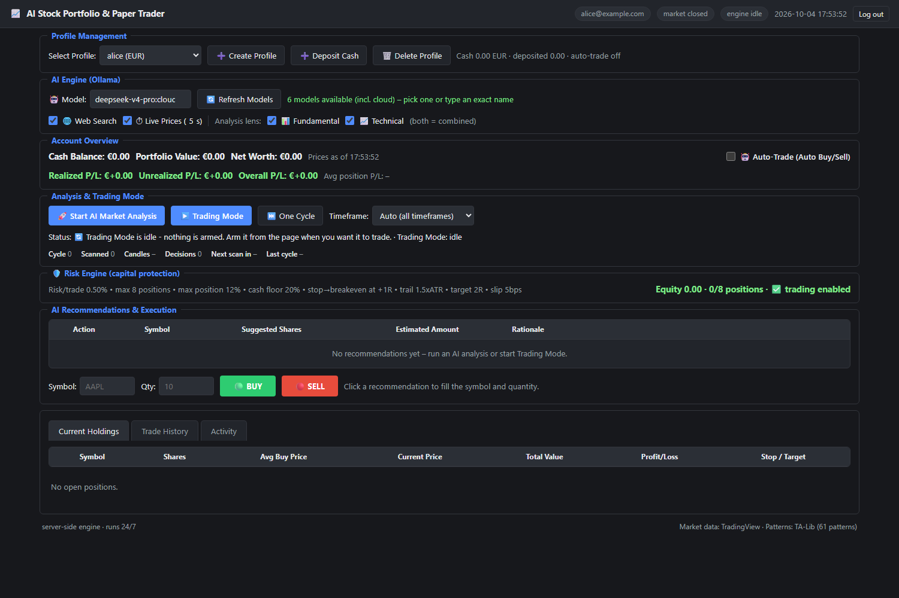

# AI Stock Portfolio & Paper Trader — web build

The same paper-trading app as `paper_trading_app_TV.py`, but the engine runs
**inside a server** and you use it from any browser: your laptop, your phone, a
tablet, from anywhere. No Python, no install and no open window on the device
you are looking at it from.

[](docs/screenshot-holdings.png)

> **Free hosting, start here:** [`deploy/FREE-STACK.md`](deploy/FREE-STACK.md)
> explains how to run this with no server of your own and no monthly cost:
> GitHub Actions runs the trading loop, Render serves this page, and a free
> PostgreSQL database (Neon) holds the ledger. The app talks to PostgreSQL
> through `pg_compat.py`, so nothing else changes - on this machine it still uses
> SQLite exactly as before.

The important consequence: **the trading engine is not your browser.** It lives
in the server process and keeps scanning the S&P 500 on its own schedule, so an
open laptop is not part of the loop. Close the page, shut the computer down,
reopen it a week later — the account kept trading the whole time, and the
dashboard shows what happened while you were away.

---

## 1. How it is put together

| File | Role |
| --- | --- |
| `paper_trading_app_TV.py` | The **desktop app AND the trading logic**. All the real decisions (patterns, sizing, risk, guard rails) live here. Not modified by the web build. |
| `engine.py` | `TradingEngine`: runs the same logic headlessly (no Tk window) and writes trades to the database. |
| `accounts.py` | Accounts: the `users` table, password hashes, portfolio ownership, per-account Trading Mode. |
| `app_web.py` | The **server**: standard-library HTTP, accounts + login, session cookie, JSON API, static files, and the `Scheduler` thread that drives Trading Mode. |
| `cloud_llm.py` | Optional: runs the AI analysis against any OpenAI-compatible API when the server has no Ollama. |
| `tv_data.py` | Market data: TradingView scanner + chart websocket, S&P 500 symbol list. |
| `web/index.html`, `web/styles.css`, `web/app-client.js` | The browser UI (a small single-page app, no build step, no npm). |
| `web/API.md` | The frozen HTTP API contract, if you want to script against it. |
| `docs/` | Screenshots. |
| `deploy/`, `Dockerfile`, `docker-compose.yml`, `.env.example` | Deployment for a server that runs it 24/7, including the Oracle Cloud Always Free walkthrough (§12). |

> **A leftover that is now gone:** `web/app.js` was an earlier copy of the
> client that a file lock prevented me from overwriting during the build.
> Nothing loads it (`index.html` loads `app-client.js`) and it has been deleted;
> if a copy ever reappears in the folder, it is still dead weight.

**Hosting it for other people?** The app is multi-user now: everyone registers
their own account and sees only their own portfolios. Read **§11** (accounts),
**§12** (free hosting on Oracle Cloud) and **§13** (AI on a server with no
Ollama).

Because the desktop app and the website call the *same* engine functions, the
numbers, the risk policy and the reasoning text cannot drift apart. The web
build is a second front end, not a second implementation.

**Why this server and not Flask + Waitress + Jinja2?** The workspace already
contained a complete, production-shaped HTTP server for exactly these routes —
standard library only, with scrypt password login, signed session cookies,
login throttling, static delivery and the scheduler thread that drives Trading
Mode. Adding Flask and Waitress on top would have meant a second HTTP layer, a
second dependency set, and a second place for the trading rules to drift, so the
piece that was genuinely missing — the browser UI — was built against the server
that was already there. Nothing in the app needs a server-side dependency now
(only the market-data layer needs pandas + websocket-client), which is also the
easiest thing to keep alive for months. If you specifically want a WSGI
deployment (`waitress`/`gunicorn` behind nginx), that is a small change to the
entry point — ask and it can be added.

## 2. Run it on this computer (2 minutes)

Windows: double-click **`start_web.bat`**.

macOS / Linux:

```bash
./start_web.sh
```

Or directly, on any system:

```bash
pip install -r requirements.txt      # once: pandas + websocket-client
python app_web.py
```

Then open **http://127.0.0.1:8080**.

The **first run prints a generated password** in the terminal — that is the
**owner** account's password (the account that adopts anything created before
multi-user support existed). It is shown once and stored only as a scrypt hash in
`web_config.json`.

```
  ------------------------------------------------------------
  OWNER PASSWORD (shown once, lives hashed in web_config.json):
      kQ3mE8zR1vXd
  Log in with it and any e-mail field you like.
  ------------------------------------------------------------
```

Sign in by leaving the e-mail blank, or with `owner@localhost`. Everybody else
presses **Create an account** on the same card and gets their own portfolios —
see §11.

Forgot it, or want a new one? `python app_web.py --reset-password` prints a fresh
password for the owner (add an e-mail to reset somebody else's) and exits;
restart the server afterwards.

### Use it from your phone on the same Wi-Fi

```bash
python app_web.py --host 0.0.0.0
```

The startup banner then prints the address to type on the other device, e.g.
`http://192.168.1.24:8080`. Only do this on a network you trust: over plain
HTTP the login password travels in clear text. For anything beyond your own
LAN, use TLS (section 4).

### Command line

| Flag | Meaning |
| --- | --- |
| `--host 127.0.0.1` | Bind address. Default is localhost only. `0.0.0.0` = all interfaces. |
| `--port 8080` | Port. |
| `--db PATH` | Use a different database file. |
| `--reset-password [EMAIL]` | Print a new password for that account (the owner's by default) and exit. |
| `--verbose` | Log every HTTP request (noisy, useful when debugging). |

## 3. What you can do in the UI

Everything the desktop app does, in the same panels:

- **Profile Management** — create (`Create Profile`), pick, deposit/withdraw
  (`Deposit Cash`), delete. Deposits and withdrawals are recorded as ledger
  rows, so "deposited" stays truthful.
- **AI Engine (Ollama)** — choose the model, `Refresh Models`, toggle
  **Web Search** (pulls current news/context into the prompt) and **Live
  Prices** (5 s refresh), pick the **analysis lens**: Fundamental, Technical,
  or both (= combined).
- **Account Overview** — cash, portfolio value, net worth, realized /
  unrealized / overall P/L, average per trade, % of deposits, average position
  P/L, price timestamp, and the **Auto-Trade** switch.
- **Analysis & Trading Mode** — `Start AI Market Analysis` (LLM recommendations)
  and `Trading Mode` (the deterministic candle-pattern engine), `One Cycle` to
  scan once without disturbing the schedule, the timeframe picker, and live
  metrics: status, cycle count, symbols scanned, candles, decisions, next scan
  countdown, last cycle time.
- **Risk Engine** — the live parameters (never hard-coded in the UI) plus
  equity, today's P/L, drawdown from peak, position count against the cap, and
  a red **trading halted** state with its reason when a breaker trips.
- **AI Recommendations & Execution** — the decision table (Action, Symbol,
  Suggested Shares, Estimated Amount, Rationale). Click a row to load it into
  the manual `BUY` / `SELL` ticket.
- **Tabs** — **Current Holdings** (7 columns, including `Stop / Target`),
  **Trade History** (every fill with realized P/L and the engine's reason;
  `Edit Price of Selected Trade` corrects an execution price and recalculates
  cash, average cost and realized P/L; `Clear History` wipes the ledger),
  **Activity** (the engine log).

[](docs/screenshot-history.png)

> ⚠️ **Auto-Trade is a live switch, and it covers AI orders.** With
> *Auto-Trade* ticked, pressing **Start AI Market Analysis** executes whatever
> the model returns, immediately and without further confirmation — that is the
> desktop app's behaviour (`if auto_var.get(): execute_auto_trades(recs, prices)`),
> kept identical here because this build is meant to be the same app. Leave the
> box unticked if you want the suggestions to stay suggestions: the rows still
> fill the table and you place the orders yourself.

[](docs/screenshot-activity.png)

## 4. Run it 24/7 on a server

This is the point of the web build: put it on a small VPS and it works whether
or not your own computer is on. For **free** hosting, §12 walks through Oracle
Cloud's Always Free tier with a script that does all of this for you.

### 4a. Docker Compose (easiest)

```bash
cp .env.example .env        # optional: accounts, invite code, AI endpoint
mkdir -p data
docker compose up -d --build
docker compose logs -f
```

- `restart: unless-stopped` means it comes back after a reboot or a crash.
- The database and `web_config.json` live in `./data` on the host
  (`PAPER_TRADER_DB` / `PAPER_TRADER_CONFIG` point inside the container), so
  recreating the container never loses the accounts or the password.
- `.env` carries the account and AI settings (§5) and is gitignored.
- The port is published on `127.0.0.1` only — put a TLS proxy in front
  (section 4c).

### 4b. systemd (no Docker)

```bash
sudo useradd -r -s /bin/false paper
sudo mkdir -p /opt/paper-trader && cd /opt/paper-trader
# copy app_web.py accounts.py cloud_llm.py engine.py paper_trading_app_TV.py \
#      tv_data.py requirements.txt web/
python3 -m venv .venv && .venv/bin/pip install -r requirements.txt
sudo cp deploy/paper-trader.service /etc/systemd/system/
sudo nano /etc/systemd/system/paper-trader.service     # set User/WorkingDirectory
sudo systemctl daemon-reload && sudo systemctl enable --now paper-trader
journalctl -u paper-trader -f
```

`Restart=always` in that unit is what makes it unattended. A normal shutdown
does **not** count as "stop trading" — see the next section.

### 4c. TLS in front of it (required for the open internet)

```bash
sudo cp deploy/nginx.conf /etc/nginx/sites-available/paper-trader
sudo mkdir -p /etc/nginx/snippets
sudo cp deploy/paper-proxy.conf /etc/nginx/snippets/
# edit the domain in nginx.conf, then:
sudo ln -s /etc/nginx/sites-available/paper-trader /etc/nginx/sites-enabled/
sudo nginx -t && sudo systemctl reload nginx
sudo certbot --nginx -d trader.example.com        # free, auto-renewing
```

The login cookie is a bearer credential: **plain HTTP over the internet would
hand it to anyone on the path.** HTTPS is not optional there. (A ready-made
Caddy alternative ships as `deploy/Caddyfile` — `trader.example.com {
reverse_proxy 127.0.0.1:8080 }` — and it obtains the certificate itself; the
Oracle walkthrough in §12 uses exactly that. A Cloudflare Tunnel also works and
needs no open inbound port.)

Also firewall the app port so only the proxy can reach it:

```bash
sudo ufw allow 22,80,443/tcp && sudo ufw enable
```

### 4d. Ollama

The Trading Mode engine needs **no AI model at all** — it is pure candle
patterns and the risk engine, and it works on a bare VPS. Ollama is only needed
for `Start AI Market Analysis` (the LLM recommendations).

If Ollama runs elsewhere, point the app at it — no code change:

```bash
OLLAMA_BASE_URL=http://10.0.0.5:11434 python app_web.py        # systemd: Environment=
OLLAMA_TIMEOUT_S=600                                            # slow/large models
```

With Compose, `host.docker.internal:11434` reaches Ollama on the Docker host
(already wired up), or start the bundled profile:
`docker compose --profile ollama up -d`. The default model
`deepseek-v4-pro:cloud` is a cloud model, so it only needs outbound HTTPS and a
local Ollama acting as the gateway.

### 4e. It survives reboots — and remembers what it was doing

A brand-new deployment starts **idle**: nothing is armed until somebody presses
Trading Mode, so a fresh install cannot begin buying and selling before anyone
has even logged in. The first press is what arms it.

**Trading Mode is per account.** Pressing it arms *your* portfolio; another
account pressing it arms theirs. Each armed portfolio is remembered in the
`users` table of the database, and on the next start the engine resumes exactly
the accounts that were armed — the log names them:

```
🔄 resuming Trading Mode for bob@example.com on portfolio 993.
```

Switching to a different portfolio in the page does **not** move what is
trading: the armed portfolio is stored on the account, so you can look at
portfolio B while portfolio A keeps running. `Stop` arms down (and, being a
decision, that also survives a restart); an ordinary server shutdown does not —
restarting a server must never be mistaken for "stop trading".

One economy worth knowing: the expensive part of a cycle is the S&P 500 scan,
and it is **shared**. Ten armed accounts at the same timeframe cost one sweep,
not ten; only the decisions and the executions are per portfolio.

> **Upgrading from the single-user build.** The old build kept "was Trading Mode
> on?" in `web_config.json` and wrote it on every Start/Stop. That flag is
> deliberately **not trusted silently** on the first start after this upgrade:
> the app comes up idle and prints why. Press Trading Mode once, or start with
> `PAPER_TRADER_RESUME_ARM=1` to honour the old flag. From then on, arming lives
> in the database and is resumed on every restart.

## 5. Configuration

`web_config.json` (next to the code, or wherever `PAPER_TRADER_CONFIG` points):

| Key | Meaning |
| --- | --- |
| `password_hash` | scrypt hash of the **owner** account's password. Reset with `python app_web.py --reset-password [email]`. |
| `session_secret` | Signing key for session cookies (the user id is signed inside the cookie). Changing it logs everyone out. |
| `auto_start`, `auto_start_timeframe`, `auto_start_profile_id` | **Legacy**, written by the single-user build. Read once during the upgrade to know that Trading Mode used to be on — and honoured only with `PAPER_TRADER_RESUME_ARM=1`. Arming now lives in the database. |

Environment variables:

| Variable | Meaning |
| --- | --- |
| `PAPER_TRADER_DB` | Database path (default: `paper_trading_app.db` beside the code). |
| `PAPER_TRADER_CONFIG` | Config path (default: `web_config.json` beside the code). |
| `PAPER_TRADER_OWNER_EMAIL` | E-mail of the account that owns data created before accounts existed (default `owner@localhost`). |
| `PAPER_TRADER_REGISTRATION_CODE` | **Empty = open registration**: anyone with the link can create an account. Set a word to require that invite code instead. |
| `PAPER_TRADER_RESUME_ARM` | `1` = honour the legacy `auto_start` flag on the first start after the upgrade. |
| `LLM_BASE_URL` | OpenAI-compatible endpoint for the AI analysis (see §13). Empty = use Ollama as before. |
| `LLM_API_KEY` | Key for that endpoint. |
| `LLM_MODEL` | Model name to use by default at that endpoint. |
| `LLM_TIMEOUT_S` | Timeout for one analysis request (default 300 s). |
| `OLLAMA_BASE_URL` | Where Ollama listens (default `http://localhost:11434`); ignored while `LLM_BASE_URL` is set. |
| `OLLAMA_TIMEOUT_S` | Ollama request timeout in seconds (default: the app's own). |
| `TZ` | Server timezone, used for log timestamps (`Europe/Bucharest`, `UTC`, …). |

## 6. Day-to-day operations

**Backups.** Everything that matters is in two files: `paper_trading_app.db`
(account, positions, ledger, risk state) and `web_config.json` (password,
secrets, auto-start). Copy them while the server runs — SQLite is in WAL mode,
which is crash-safe — or use `sqlite3 paper_trading_app.db ".backup backup.db"`
for a fully consistent snapshot.

```bash
tar czf paper-trader-$(date +%F).tar.gz paper_trading_app.db* web_config.json
```

**Updating.** Replace the `.py` files and `web/`, then restart
(`docker compose up -d --build`, or `sudo systemctl restart paper-trader`).
The database schema is created/upgraded automatically at startup; existing data
is kept.

**Checking it is alive without logging in:**

```bash
curl -s http://127.0.0.1:8080/api/health
# {"ok": true, "engine_running": true, "talib": true, "pandas": true, "tv_available": true, ...}
```

## 7. Troubleshooting

| Symptom | Cause and fix |
| --- | --- |
| `! TradingView data layer problem:` at startup | `pandas` or `websocket-client` is missing. `pip install -r requirements.txt`. |
| `Cannot reach Ollama at http://localhost:11434` | Ollama is not running or is elsewhere. Start it, or set `OLLAMA_BASE_URL`. Trading Mode still works without it. |
| Everything is grey / "market closed" | Correct behaviour outside US market hours: quotes are the last close, and a scan still runs. |
| `database is locked` | An old copy is open in the desktop app or a DB browser. Close it; the server enables WAL and a 10 s busy timeout. |
| Login page keeps coming back | Cookies blocked for the site, or you are on `http://` while the TLS proxy redirects to `https://`. Allow cookies for the exact host. |
| Nothing trades in Trading Mode | Trading Mode only *enters* when a pattern scores high enough and the risk engine allows it; it also refuses when the cash floor or position cap are hit. The log says which guard rail blocked it. |
| The header says "engine busy on another account" and my portfolio never trades | Each account arms its own portfolio. Arm yours with Trading Mode as well — the S&P 500 scan is then shared, so the second account costs almost nothing extra. |
| Registration refuses the invite code, or lets anybody in | `PAPER_TRADER_REGISTRATION_CODE` is wrong — or empty, which means open registration. Change it and restart. |
| AI analysis fails with `401`/`429 from https://…` | That is the AI endpoint's own message: wrong `LLM_API_KEY`, no credit, or a spend cap. Trading Mode never depends on the AI. |
| Scan is slow the first time | The S&P 500 list and each symbol's candles are fetched over the network (a full scan is roughly 20–60 s). Later cycles reuse cached candles. |

## 8. Deliberate differences from the desktop app

Small, intentional, and all improvements:

1. **Trading Mode decisions appear in the recommendations table** as
   `BUY (new)` / `SELL (exit)` rows, so the web UI shows what the engine just
   decided — the desktop fills its own tree from the same result.
2. **Holdings has a 7th column, `Stop / Target`**, showing the live stop loss
   and take profit (and the trail), which the desktop build keeps implicit.
3. **`Clear History`** exists as an explicit button in Trade History.
4. **An Activity tab** shows the engine log (the desktop shows it in its own
   log panel).
5. **Manual web trades apply the same slippage** as the engine, so a manual
   fill cannot be better than the strategy's own fills.
6. **`Edit Price of Selected Trade` reports the real reason** when it refuses
   (for example *"That price would overdraw the account by 989,999.00; deposit
   cash first."*) instead of silently failing.
7. Duplicate profile names are **rejected with a 400** and a clear message.

## 9. Security notes

- **Multi-user by design**: every account signs in with its own e-mail and
  password, and only ever sees its own portfolios — positions, ledger, risk
  state, recommendations and settings are all fetched through the session's user
  id. Asking for somebody else's portfolio answers `404`, not `403`, so the API
  does not even confirm that it exists.
- Sessions are HttpOnly cookies signed with `session_secret`, carrying the user
  id *inside* the signature; a pre-upgrade single-password cookie is rejected
  because it has no user id to check.
- Passwords are stored as scrypt hashes (salted, per account); repeated bad
  logins are throttled per client address.
- **Registration is open unless you close it.** With
  `PAPER_TRADER_REGISTRATION_CODE` set, the register form asks for the invite
  code; without it, anyone who has the URL can create an account. Decide which
  you want *before* you put it on the internet.
- The **Activity log is the server's log**, so it covers every account's cycles.
  Any e-mail address in it that is not yours is shown as `another account` (the
  owner sees the real ones).
- The **owner account** (`owner@localhost` by default) owns everything that
  existed before accounts. Its password is the one printed on first start, and it
  can be rotated with `python app_web.py --reset-password owner@localhost`.
- The AI analysis uses one server-wide model/key, so on a shared deployment every
  account spends the same credits — see §13 for limiting that.
- Run it behind HTTPS (section 4c) and keep the raw port on localhost.
- `web_config.json`, `.env` and the database contain secrets/data — they are in
  `.gitignore` and `.dockerignore` on purpose. Do not commit them.

## 10. First run checklist

1. `pip install -r requirements.txt`
2. `python app_web.py` → copy the printed owner password → open
   http://127.0.0.1:8080
3. Sign in (leave the e-mail blank to use the owner account, or register your
   own), then `Create Profile` (name + currency) → `Deposit Cash` to give it
   paper money
4. Pick a model with `Refresh Models`, then `Start AI Market Analysis` to see
   the LLM side; click a recommendation row to load it into the ticket and press
   `BUY`.
5. Press `Trading Mode` and watch the metrics — or `One Cycle` for a single scan.
6. When it looks right, deploy it to a server (section 4, or the free Oracle
   Cloud walkthrough in §12) and start it once; it will keep going on its own.

## 11. Accounts: several people, one server

[](docs/screenshot-login.png)

New users press **Create an account** on that card:

[](docs/screenshot-register.png)

Each account has an e-mail, a password and its **own set of portfolios**. What is
private per account:

| Private to the account | Shared |
| --- | --- |
| Portfolios, cash, positions, ledger, realized P/L | The S&P 500 market data and its cache |
| Risk state (day loss, drawdown, halts), Auto-Trade switch | The AI model choice and the API key |
| Trading Mode arming, timeframe, current portfolio | The engine loop and its one analysis slot |
| AI suggestions for its own portfolios | The activity log (with other accounts' tags hidden) |

**The owner account.** The first account is the *owner*: it adopts everything
that existed before accounts did (the printed password and all portfolios), so
upgrading loses nothing. It is `owner@localhost` unless you set
`PAPER_TRADER_OWNER_EMAIL`.

**Registering.** New users press *Create an account* on the login card, choose an
e-mail, a password of at least 8 characters and the paper currency to trade in,
and are signed in immediately with one empty portfolio. If
`PAPER_TRADER_REGISTRATION_CODE` is set, the form asks for that code first.

**Passwords.** `python app_web.py --reset-password someone@example.com` prints a
new random password and stores its hash. With no e-mail argument it does that for
the owner account.

**Adding a user from the shell** (no registration form needed) is the same two
steps the form performs: insert into `users`, then create a portfolio and set its
`user_id`. In practice, open registration plus a quick `--reset-password` is
easier.

**What one account cannot do to another** — all verified end to end: read the
other's history, deposit into or withdraw from their portfolio, flip their
Auto-Trade switch, arm or stop their Trading Mode, delete their portfolio,
correct the price of their trades, or see their positions and AI suggestions.

A freshly registered account sees its own empty portfolio and nothing else —
here it is right after signing up, while the owner's account above still holds
its five positions:

[](docs/screenshot-new-account.png)

## 12. Deploy it free on Oracle Cloud (Always Free)

**Start here: [deploy/ORACLE-STEP-BY-STEP.md](deploy/ORACLE-STEP-BY-STEP.md)** —
the click-by-click version (account → VM → ports → DuckDNS → one-command
deploy), including every value you have to type. The short version:

| | |
| --- | --- |
| 1. Create the VM | Oracle console, Ubuntu 24.04, free shape, **tick "Assign a public IPv4 address"**, paste the key from `C:\Users\iones\.ssh\oracle-paper-trader.pub` |
| 2. Open 80 + 443 | VCN → Security Lists → Default Security List → Add Ingress Rules |
| 3. Deploy | `powershell -ExecutionPolicy Bypass -File .\deploy\deploy-from-windows.ps1 -Server <ip> -DuckDnsName <name> -DuckDnsToken <token> -OwnerEmail <you> -RegistrationCode <word>` |

Or let Oracle build the VM itself: open **Cloud Shell** in the console (the `>_`
button) and run [deploy/oci-create-instance.sh](deploy/oci-create-instance.sh) —
it creates the VCN, gateway, route table, the security list with 22/80/443 open,
a public subnet and the instance, retrying the free ARM shape across availability
domains, then prints the public IP.

The deploy script on your PC
([deploy/deploy-from-windows.ps1](deploy/deploy-from-windows.ps1)) uploads the
project over SSH — deliberately *without* your local `web_config.json`,
`my-deployment.ps1`, database or price caches, so no local secret travels — then
runs [deploy/oracle-cloud-setup.sh](deploy/oracle-cloud-setup.sh) on the machine.

This is the only free option that actually fits the app's requirements: a
machine that never sleeps, a persistent disk for SQLite, and outbound HTTPS to
TradingView.

### Hosts that cannot run this app

So nobody wastes an evening on one of these:

| Host | Why it cannot work |
| --- | --- |
| **InfinityFree** (and any free PHP shared host) | It is PHP 8.4 + MySQL only — Python is a *premium* extra there (iFastNet's paid plans advertise "Python/Ruby/Node.js support", the free plan does not have it). And shared PHP hosting only runs your code while a request is being served, so there is no way to keep the Trading Mode thread scanning between requests. Uploading the files gives you a login page and a `404` on every API call. |
| Render free, Koyeb, Railway trial | Sleep after ~15 minutes idle and have no persistent disk: the SQLite accounts and trades disappear. |
| Hugging Face Spaces free | Python does run, but its filesystem is wiped on every restart, so the ledger is lost. |
| PythonAnywhere free | Needs no card and Python works, but outbound internet is restricted to a whitelist and the free tier allows ~100 CPU-seconds/day — one S&P 500 scan is far more than that. |
| Vercel, Netlify, Cloudflare Workers/Pages | Serverless request/response: no long-running thread and no writable SQLite file. |
| Google Cloud free `e2-micro` | This one *does* work — a real always-on VM in `us-west1` / `us-central1` / `us-east1`, same idea as Oracle, and the Docker setup here applies unchanged (a card is still required). |

**What the installer does, in order:** installs Docker, opens the instance
`iptables` chain for 80/443 (Oracle images pre-load a REJECT rule that the VCN
rules cannot override), points DuckDNS here and installs a 5-minute refresh job,
builds the image, starts it with `restart: unless-stopped`, and puts Caddy in
front for automatic HTTPS. Without `DOMAIN` or DuckDNS settings it warns,
because serving a login form over plain HTTP would leak the password.

**1. Create the instance** in the Oracle Console → *Compute → Instances*:

- Shape: `VM.Standard.E2.1.Micro` (AMD, always free) or `VM.Standard.A1.Flex`
  (Ampere ARM, always free — 4 OCPU / 24 GB, plenty).
- Image: Canonical Ubuntu 22.04 or 24.04.
- Download/save the SSH key it offers, then connect:

```bash
ssh ubuntu@<public-ip>
```

**2. Open the ports in the console first** (this is the step everybody misses):
*Networking → Virtual Cloud Networks → your VCN → Security Lists → Default
Security List → Add Ingress Rules*, twice:

| Source | IP Protocol | Destination Port |
| --- | --- | --- |
| `0.0.0.0/0` | TCP | `80` |
| `0.0.0.0/0` | TCP | `443` |

Port 22 is already open for SSH.

**3. Copy the project to the instance** (`scp -r` the folder, or `git clone`),
then run the setup script. It installs Docker, opens the *instance* firewall
(Oracle images pre-load an `iptables` chain that rejects everything but SSH —
both layers must allow the port), builds the image, starts it with
`restart: unless-stopped`, and puts Caddy in front for automatic HTTPS:

```bash
cd paper-trader/deploy
sudo DOMAIN=trader.yourdomain.com ./oracle-cloud-setup.sh
```

Any DNS name works. If you do not own a domain, a free **DuckDNS** subdomain
(`yourname.duckdns.org` → the VM's public IP) is enough for the certificate.
Without `DOMAIN` the script still installs everything but warns that the site is
reachable on the VM itself only, because serving the login form over plain HTTP
would send the password in clear text.

Useful knobs on that first run:

```bash
sudo DOMAIN=trader.example.com \
     OWNER_EMAIL=me@example.com \
     REGISTRATION_CODE=let-me-in \
     LLM_BASE_URL=https://api.deepseek.com/v1 \
     LLM_API_KEY=sk-... LLM_MODEL=deepseek-chat \
     WITH_TALIB=1 \
     ./oracle-cloud-setup.sh
```

**4. Afterwards**, from `/opt/paper-trader`:

```bash
docker compose logs -f          # watch it work (the owner password is here)
docker compose restart          # restart the app
docker compose up -d --build    # update after copying new code
docker compose down             # stop everything
```

The database and config live in `/opt/paper-trader/data`, outside the container,
so rebuilding or recreating it never loses the accounts. Back it up with:

```bash
tar czf ~/paper-trader-$(date +%F).tar.gz -C /opt/paper-trader data
```

**If the page does not load**, check, in this order: the VCN Security List
(step 2), the instance firewall
(`sudo iptables -L INPUT --line-numbers -n | head`), and that the container is up
(`docker compose ps`). A healthy app answers
`curl -s http://127.0.0.1:8080/api/health` on the VM itself.

## 13. AI analysis without Ollama (any OpenAI-compatible API)

The desktop build asks a local Ollama. A free VM cannot run a useful model, so
the server can instead talk to any OpenAI-compatible endpoint — OpenAI, DeepSeek,
Groq, Together, OpenRouter, or a vLLM/llama.cpp server on another machine. Set:

| Variable | Example |
| --- | --- |
| `LLM_BASE_URL` | `https://api.deepseek.com/v1` |
| `LLM_API_KEY` | `sk-…` |
| `LLM_MODEL` | `deepseek-chat` |

The prompt is still built by `paper_trading_app_TV.py`, so the model sees exactly
the same instructions as with Ollama; only the transport changes. The Analysis
tab then works normally (including *Refresh Models*, which lists the endpoint's
models), and `GET /api/models` reports `"engine": "openai-compatible"`. With no
`LLM_BASE_URL` nothing changes and Ollama is used exactly as before.

Two things to weigh on a shared server:

- **Cost.** Everyone's analysis spends the same key. Keep an eye on the provider
  spend cap, and prefer a cheap model: a full analysis is one prompt with the
  candidate list, not a chat.
- **Privacy.** The prompt contains your portfolio, cash and holdings. Any of
  those providers will see it. A self-hosted endpoint (`http://10.0.0.5:8000/v1`)
  keeps it in your own network — that is why the URL is configurable rather than
  hard-coded.

If you want the analysis limited to the owner only on a shared deployment, ask
and it is a small change (an `ai_owner_only` switch on the analyse route).
